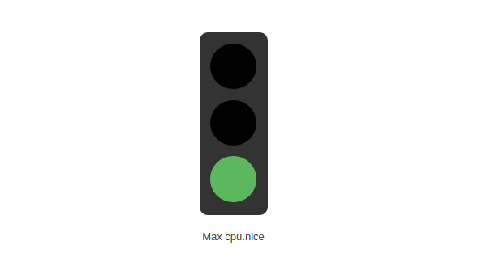

kibana-plugin-traffic
=====================



Introduction
-------------

Ce plugin permet la création d'un graphique de type feu tricolor sur Kibana 4.x et 5.x:

* Définition du label
* Définition des niveaux

Contenu
-------
```
.
├── index.js
├── package.json
├── public
│   ├── traffic_sg_controller.js
│   ├── traffic_sg.html
│   ├── traffic_sg.js
│   ├── traffic_sg.less
│   └── traffic_sg_params.html
└── README.md
```
Le plugin a été créé à partir des librairies Kibana et basé sur le framework Angularjs.


Installation
------------

Pour les versions de kibana-4.x:
```
        $ cd <path>/kibana/installedPlugins
        $ git clone -b 4.x <depot> traffic-sg
```

Pour les versions de kibana-5.x:
```
        $ cd <path>/kibana/plugins
        $ git clone <depot> traffic-sg
```

Désinstallation
---------------

```
        $ bin/kibana plugin  --remove traffic_sg
```

